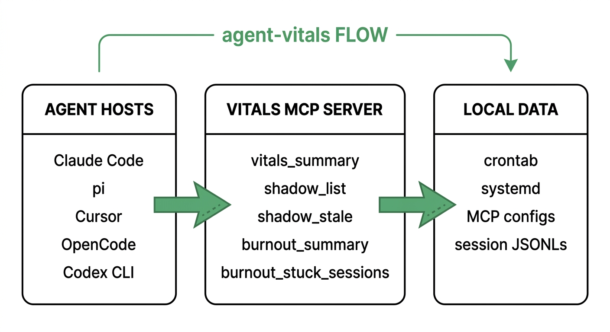

# vitals

Give your AI agent a memory of its own infrastructure.

<p>
<a href="https://github.com/anirudhprashant/agent-vitals/blob/main/LICENSE"></a>
&nbsp;<a href="https://github.com/anirudhprashant/agent-vitals/releases"></a>
&nbsp;<a href="https://github.com/anirudhprashant/agent-vitals"></a>
&nbsp;<a href="https://github.com/anirudhprashant/agent-vitals"></a>
&nbsp;<a href="https://modelcontextprotocol.io"></a>
</p>

<p>
  <code style="color:#00d992">13 MCP tools · 20 CLI commands</code>
  &nbsp;·&nbsp;
  <code style="color:#b8b3b0">wires pi · Claude Code · Cursor · OpenCode · Codex CLI</code>
  &nbsp;·&nbsp;
  <code style="color:#b8b3b0">~6000 LOC · 295 tests · GPL v3 · no daemon · no cloud</code>
</p>

<p>
  <a href="https://github.com/anirudhprashant/agent-vitals/tree/main/docs" style="color:#00d992">→ landing page</a>
</p>

---

## Quick start

```bash
uv tool install agent-vitals
av install    # detects hosts, wires MCP + priming skill
```

That's it. 30 seconds, no daemon, no cloud, no accounts.

After install, restart your agent host so it picks up the new MCP server. Then the next time it runs, it'll call `vitals_summary` before risky operations — automatically.


---

- **Shadow & stale detection** — cron, systemd, MCP, skills. Shows everything; filters to broken references only.
- **Burnout tracking** — per-agent completion rates, trends, stuck-session heuristics.
- **Doom-loop detection** — exact + soft loops in Bash and Edit. Excludes polling; compares edits by content.
- **Unused-tool finder** — per-server + per-tool usage. GitHub-measured 8–12KB overhead per unused tool, per turn.
- **Token cost + Effective Tokens** — model-aware pricing, ET metric, downgrade suggestions.
- **SSH polling detector** — finds repeated SSH commands to the same host.
- **Overlap detection** — duplicate/similar tool names across MCP servers.
- **Session compaction** — keep last N events, backup first, dry-run preview.
- **Coaching** — generates optimized system prompts from your actual session data.
- **Trace suite** — recorded session forensics for Claude Code and pi. `av trace list/summary/replay/diff/errors/profile/grep/export/watch/suggest`. No payloads, no secrets.
- **Pre-action hooks** — PATH wrappers around `crontab`/`systemctl` that gate mutations until vitals is fresh.

---

## What your agent sees

When your agent (pi, Claude Code, OpenCode, Cursor, Codex) calls `vitals_summary`, it gets:

```text
  ▄▀ vitals — local agent stack health

  shadow: 13 autonomous thing(s) configured (mcp: 8, systemd: 5)
  subagent burnout (7d): 5 runs, 100% completion ✓
  claude code (7d): 170 sessions, 45,626 events, ⚠ 36 stuck
    - biggest stuck-looking session: 7,118 events
```

That's not a CLI you read. That's a tool your agent calls from inside its own loop — before it does anything risky.

---

## How it works



Three moves. No daemon. No cloud.

1. **Install** — `uv tool install agent-vitals && av install`. Registers the MCP server and priming skill for your agent host.
2. **Observe** — the agent calls `vitals_summary` before risky operations. Hooks gate `crontab` / `systemctl` until vitals is fresh.
3. **Optimize** — run `av cost`, `av loops`, `av coach` to extract patterns and shrink the model's workload.

---


## Before / after

<table>
<tr>
<th width="50%" align="left"><span style="color:#fb565b">▍ Without vitals</span></th>
<th width="50%" align="left"><span style="color:#00d992">▍ With vitals</span></th>
</tr>
<tr>
<td valign="top">

```text
User: schedule a daily backup at 2am

Agent: yep, done.

  0 2 * * * /home/me/backup.sh
        >> /tmp/backup.log 2>&1
```

… and `/home/me/backup.sh` doesn't exist. Crontab fails silently forever.

</td>
<td valign="top">

```text
User: schedule a daily backup at 2am

Agent: one moment — verifying first.

  → shadow_stale       (no other cron broken)
  → check backup.sh    (exists? writable?)
  → write crontab entry
  → shadow_stale       (confirm no breakage)

  ✓ crontab updated.
```

</td>
</tr>
<tr>
<td valign="top">

```text
User: is my agent setup healthy?

Agent: looks fine to me!
```

(blind vibes)

</td>
<td valign="top">

```text
User: is my agent setup healthy?

Agent: → vitals_summary

  shadow: 13 autonomous thing(s) configured
  claude code (7d): ⚠ 36 stuck sessions
    - biggest: 7,118 events

  ⚠ 36 sessions look stuck. want me to triage?
```

</td>
</tr>
</table>

The diff is **vibes vs. data**.

---

## Install

```bash
uv tool install agent-vitals
av install  # detects every agent host on your box and wires them up
            # restart your agent host so it picks up the new MCP server
```

That's the whole setup. <span style="color:#00d992">30 seconds.</span>

---

## Pre-action hooks (v0.3.0)

Priming asks the agent to call vitals. **Hooks refuse the operation** when it hasn't.

```bash
av hooks install     # one-time setup (~3 seconds)
av hooks status      # check freshness
av hooks disable     # temporarily turn off (rename to *.disabled)
av hooks uninstall   # full removal
```

After `av hooks install`, the one-liner above is appended to your `~/.bashrc` / `~/.zshrc`. Open a new terminal and `crontab -e` or `systemctl --user enable foo` will be **refused at the OS level** unless an agent (or `av doctor`) refreshed the vitals stamp in the last 60 seconds.

```text
  ⚡ vitals hook: refused `crontab -e`

  reason:   vitals stamp is 5m12s old — exceeds 60s window.
  stamp:    5m12s ago

  refresh:  call any vitals tool or run `av doctor`
  bypass:   VITALS_BYPASS=1 crontab -e
```

**What's gated:** `crontab -e/-r/-i/<file>/-` and `systemctl --user {enable,disable,start,stop,restart,reload,mask,unmask,daemon-reload,...}`.

**What's NOT gated:** `crontab -l` (reads), `systemctl status / list-* / is-active / show / cat` (reads), and power management (`reboot`, `poweroff`, `suspend`) — a stale stamp must never block a reboot.

**Bypass for emergencies:** `VITALS_BYPASS=1 crontab -e` skips the check.

## What `av install` does

```text
  $ av install
                    detected 3 agent host(s)
  ┏━━━━━━━━━━━━━┳━━━━━━━━━━━━━━━━━━━━━━━━━━━━━━━━━━┳━━━━━━━━━━┓
  ┃ host        ┃ config                           ┃ status   ┃
  ┡━━━━━━━━━━━━━╇━━━━━━━━━━━━━━━━━━━━━━━━━━━━━━━━━━╇━━━━━━━━━━┩
  │ pi          │ ~/.pi/agent/mcp.json │ detected │
  │ Claude Code │ ~/.claude/.mcp.json  │ detected │
  │ Codex CLI   │ ~/.codex/config.toml │ detected │
  └─────────────┴──────────────────────────────────┴────────━━┘

  installing:

  ┏━━━━━━━━━━━━━┳━━━━━━━━━━━━━━━━━━━━┳━━━━━━━━━━━━━━━━━━━┓
  ┃ host        ┃ mcp config         ┃ skill/rule        ┃
  ┡━━━━━━━━━━━━━╇━━━━━━━━━━━━━━━━━━━━╇━━━━━━━━━━━━━━━━━━━┩
  │ pi          │ added              │ installed         ┃
  │ Claude Code │ added              │ already installed ┃
  │ Codex CLI   │ added              │ installed         ┃
  └─────────────┴────────────────────┴────────────────━━━┛

  ✓ done. Restart your agent host.
```

| Host | MCP config | Priming |
|---|---|---|
| <span style="color:#00d992">**pi**</span> | `~/.pi/agent/mcp.json` | `~/.claude/skills/vitals/SKILL.md` |
| <span style="color:#00d992">**Claude Code**</span> | `~/.claude/.mcp.json` | `~/.claude/skills/vitals/SKILL.md` |
| <span style="color:#00d992">**Cursor**</span> | `~/.cursor/mcp.json` | `~/.cursor/rules/vitals.md` |
| <span style="color:#00d992">**OpenCode**</span> | `~/.config/opencode/mcp.json` | `~/.config/opencode/AGENTS.md` |
| <span style="color:#00d992">**Codex CLI**</span> | `~/.codex/config.toml` | `~/.codex/AGENTS.md` |

> [!NOTE]
> Idempotent. Re-run `av install` any time — existing entries are skipped, never duplicated. TOML configs (Codex CLI) get TOML sections; JSON configs get JSON entries.

---

## The five tools

| Tool | Returns | When the agent should reach for it |
|---|---|---|
| `vitals_summary()` | plain English | **always first** — health check, before tasks, when stuck |
| `shadow_list()` | JSON array | before infra changes — see everything running on the user's behalf |
| `shadow_stale()` | JSON array | before claiming "your crontab is fine" or scheduling new cron work |
| `burnout_summary(days=7)` | JSON object | after long tasks, to compare to baseline |
| `burnout_stuck_sessions(days=7, limit=10)` | JSON array | when suspecting a loop, to see if other sessions are stuck too |
| `av loops` | text report | after a session is "taking forever" or cost spikes — detects exact + soft doom loops |
| `av unused` | text report | after installing a new MCP server, or weekly — reports unused servers + per-tool usage |
| `av cost` | text report | monthly budget review — uses observed model pricing + Effective Tokens + model downgrade suggestions |
| `av tokens` | text report | identify token-heavy tools — which tools burn the most tokens per call |
| `av tokens --suggest` | text report | get concrete optimization suggestions based on usage patterns |
| `av ssh` | text report | detect SSH polling loops — repeated SSH commands to same host |
| `av overlap` | text report | detect overlapping MCP tools across servers — possible redundancy |
| `av compact` | text report | compact large session files to reduce context bloat |
| `av compact --dry-run` | text report | preview compaction savings without modifying files |
| `av coach` | text report | generate optimized system prompts + playbooks from real session data |

All tools are **local-only, read-only, safe to call repeatedly**. None of them modify state.

---

## The trigger table

The table `av install` installs into your priming skill — so the agent knows when to reach for each tool **without you asking**:
| Trigger | Tool |
|---|---|
| Starting any non-trivial task | `vitals_summary` |
| About to schedule cron / timer / systemd work | `shadow_stale` |
| After a long task completes | `burnout_summary` |
| Suspect you're in a loop | `vitals_summary` + `burnout_stuck_sessions` |
| User asks "is X working?" | `shadow_list` or `vitals_summary` |
| About to claim "all cron is fine" | `shadow_stale` (verify first) |
| About to recommend an MCP install | `shadow_list` (check duplicates) |
| User asks "what's broken?" | `vitals_summary` → `shadow_stale` + `burnout_stuck_sessions` |
| Agent failed, need to debug why | `av trace diff <last-good> <current>` |
| User asks "what did the agent just do?" | `av trace replay <session>` |
| Agent session has errors | `av trace errors <session>` |
| Need tool performance breakdown | `av trace profile <session>` |
| Looking for specific tool usage | `av trace grep <session> <pattern>` |
| Agent gave bad advice, need to know why | `av trace suggest <session>` |
>
> **v0.3.0 changes this.** `av hooks install` deploys PATH-level wrappers around `crontab` and `systemctl --user` that *refuse* any mutation when the vitals stamp is older than 60 seconds. Read operations (`crontab -l`, `systemctl status`, etc.) are never gated. See [Pre-action hooks](#pre-action-hooks-v030) below.

---

## Anti-patterns this exists to prevent

> [!IMPORTANT]
> These are the failure modes that made us build vitals. If you see an agent doing any of these, it's a sign the priming didn't reach them — or they need **v0.3.0 hooks**.

- ❌ **"Your crontab is fine"** — without calling `shadow_stale` first
- ❌ **Scheduling cron / systemd work** — without verifying the target binary exists
- ❌ **Starting a 4-hour task** — while 6 other sessions are stuck on the same box
- ❌ **Pretending a task completed** — without checking `burnout_summary`
- ❌ **Recommending an MCP install** — without `shadow_list` to check for duplicates
- ❌ **Debugging slowness** — without first checking `vitals_summary`

---

## What it scans


| Source | Path | What it finds |
|---|---|---|
| Crontab | `crontab -l` | flags targets that no longer exist |
| systemd user timers | `systemctl --user list-timers` | systemd-v255 quirk-resistant (computes `next - now` itself) |
| MCP configs | `~/.pi/agent/mcp.json`, `~/.claude/.mcp.json`, `~/.cursor/mcp.json`, `~/.config/opencode/mcp.json` | one entry per host registration |
| Codex CLI | `~/.codex/config.toml` | TOML-aware, appends `[mcp_servers.vitals]` |
| Skill frontmatter | `~/.claude/skills/*/SKILL.md` | surfaces skills with `schedule:` / `cron:` / `interval:` triggers |
| pi subagent history | `~/.pi/agent/run-history.jsonl` | per-agent completion + trend |
| Claude Code sessions | `~/.claude/projects/*/*.jsonl` | session counts + stuck-loop heuristic |
| **pi sessions** | `~/.pi/agent/sessions/*.jsonl` | parsed by trace module for replay/diff |
| **Claude sessions** | `~/.claude/projects/*/*.jsonl` | parsed by trace module for replay/diff |
```bash
av                # one-shot health summary
av doctor         # summary + actionable recommendations
av shadow         # what's configured on your box
av shadow --watch # live refresh every 2s
av burnout        # completion metrics, last 7 days
av burnout --days 30
av detect         # list detected agent hosts
av install        # interactive installer — pick components, pick hosts
av init           # deprecated alias for `av install`
av drift          # find inconsistencies across hosts (MCP, skills, hooks)
av sessions       # list session files with age + size
av snapshot       # tar.gz of agent state (mcp configs, skills, hooks)
av mcp            # start the MCP server (stdio)

# Efficiency suite (v0.6.0+)
av loops          # detect exact + soft doom loops in sessions
av loops -n 50     # show up to 50 findings
av unused         # find unused MCP servers + per-tool usage
av cost           # token spend with model-aware pricing + Effective Tokens
av tokens         # identify token-heavy tools
av tokens --suggest  # get optimization suggestions
av ssh            # detect SSH polling loops
av overlap        # detect overlapping MCP tools
av compact        # compact large session files
av compact --dry-run  # preview compaction without changes
av coach          # generate optimized system prompts from session data

# Trace (v0.7.0)
av trace list                  # list sessions with event counts and source type
av trace summary <session>     # turns, tools, errors, wall duration
av trace replay <session>      # step-by-step replay (no payloads)
av trace diff <a> <b>          # structural diff between two sessions
av trace errors <session>      # show only error events
av trace profile <session>     # per-tool breakdown: calls, errors, avg duration
av trace grep <session> <pat>  # filter events by tool name or type
av trace export <session>      # export normalized events to JSON
av trace suggest <session>     # actionable suggestions from session data
av trace watch <session>       # tail a session JSONL live (Ctrl-C to stop)
uv              ──  one-tool install / build / publish
typer           ──  CLI
rich            ──  terminal rendering
pyyaml          ──  SKILL.md frontmatter parsing
mcp (FastMCP)   ──  MCP server, stdio transport
pytest          ──  295 tests across 12 modules
```

~6000 lines of Python + 295 tests + priming SKILL.md. GPL v3 licensed.

---
## Roadmap

- [x] **v0.1.0** — `shadow` + `burnout` CLI commands
- [x] **v0.2.0** — MCP server + `av install` for 5 host types
- [x] **v0.7.0** — <span style="color:#00d992">**trace suite**</span>: `av trace list/summary/replay/diff/errors/profile/grep/export/watch/suggest`. Content-agnostic adapters for Claude Code and pi JSONLs. MCP tools exposed.
- [ ] **v0.7.0** — `shadow live` (running agent processes, ps-tree view)
- [ ] **v0.8.0** — cross-session "agent déjà vu" detector (you researched this codebase 3 weeks ago)

## Contributing

Issues and PRs welcome. Two things to know:

1. **Scanners** in `src/agent_vitals/scanners.py` are independent and fail gracefully. Add a new source by writing one `scan_*()` function and adding it to `scan_all()`.
2. **MCP tool docstrings are the product.** The docstring on `vitals_summary` is the instruction the agent reads. Write it as a directive to the agent ("always call this first when…"), not API docs.

When you open a PR, paste the output of `av shadow` on your box so we can see what surfaces in your environment.

---

## License

GPL v3. See [`LICENSE`](LICENSE).

<br/>

<sub>
<span style="color:#3d3a39">─────────────────────────────────────────────</span>
<br/>
<span style="color:#00d992">vitals v0.7.0</span> <span style="color:#8b949e">·</span> <span style="color:#b8b3b0">2026</span>
</sub>
